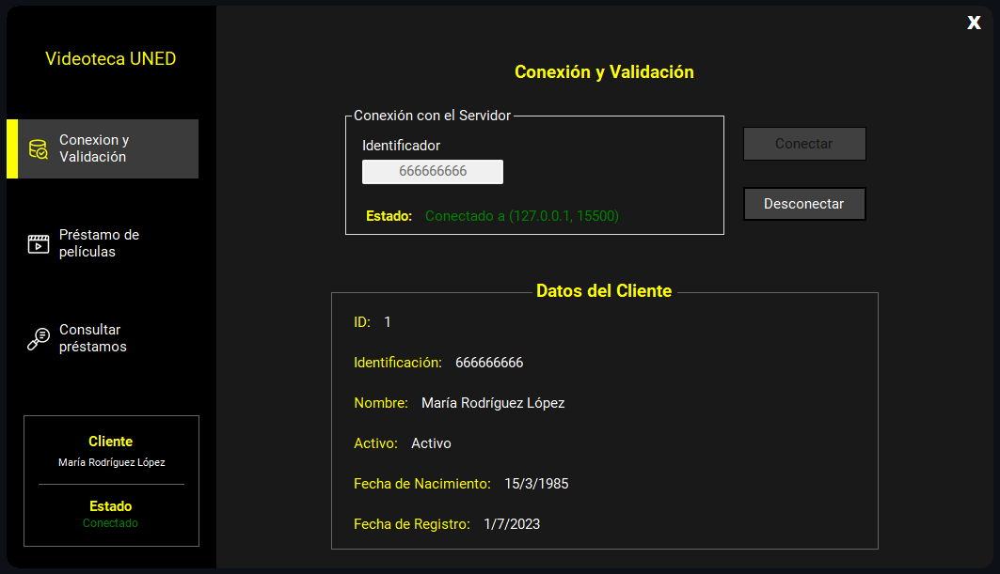
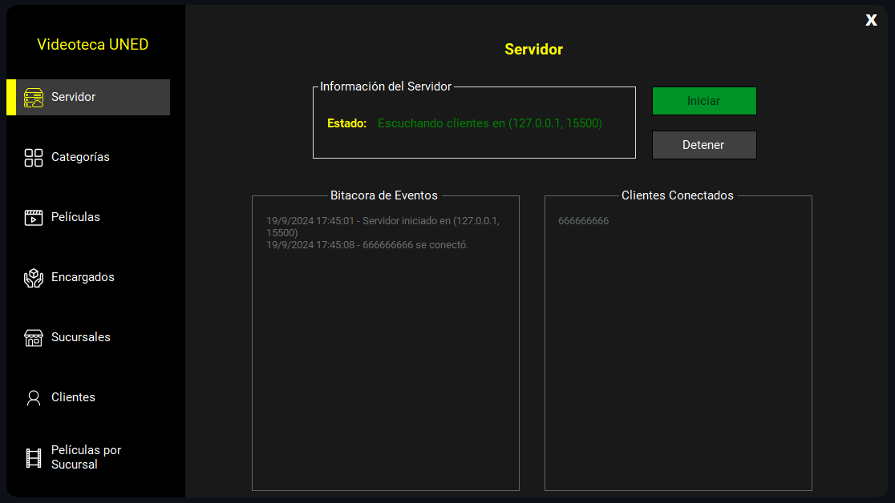

# VideotecaUNED
Este proyecto, desarrollado en C# con el framework .NET, es una solución integral para la gestión de préstamos de películas en una videoteca. El proyecto fue creado como parte del curso de Programación Avanzada (Código: 00830) de la Universidad Estatal a Distancia (UNED) en el II Cuatrimestre de 2024.

## Descripción del Proyecto

El sistema se compone de dos aplicaciones principales: un cliente y un servidor, que se comunican a través del protocolo TCP. 

### Funcionalidades Principales:

- **Cliente:** Permite a los usuarios realizar préstamos de películas en línea. La aplicación cliente:
  - Se conecta y valida al cliente contra una base de datos SQL Server.
  - Permite realizar solicitudes de préstamo y consultar préstamos realizados.
  - Muestra información sobre sucursales y películas disponibles.
  

- **Servidor:** Administra las solicitudes de los clientes, maneja las operaciones de base de datos y gestiona la lógica de negocio. El servidor:
  - Implementa subprocesamiento múltiple para manejar múltiples conexiones simultáneas.
  - Realiza operaciones CRUD para categorías de películas, películas, encargados, sucursales, y clientes.
  - Mantiene una bitácora en tiempo real de las actividades de los clientes.
  

Para ver más imágenes sobre el proyecto, consulta la carpeta [imagenes](imagenes). También puedes ver el [Video Demostración](ruta/al/video/demo.mp4).

### Tecnologías Utilizadas:

- **Lenguaje:** C#
- **Framework:** .NET Framework 4.8 / .NET 6.0
- **Base de Datos:** SQL Server
- **Protocolo de Comunicación:** TCP/IP

Este proyecto pone en práctica conceptos avanzados de programación como manejo de excepciones, subprocesamiento múltiple y comunicación en red, y está diseñado para una interfaz gráfica de usuario intuitiva.

## Instalación y Uso

1. Clona el repositorio en tu máquina local.
2. Abre la solución en Visual Studio Community 2022.
3. Configura la base de datos SQL Server según el script proporcionado.
4. Ejecuta los proyectos cliente y servidor para probar la funcionalidad completa.

Para más detalles sobre el desarrollo y la estructura del código, consulta los archivos y comentarios dentro del repositorio.

**Nota:** Este proyecto se realizó como parte del curso de Programación Avanzada de la UNED y se encuentra en una fase de prueba. Se recomienda revisar la documentación y los comentarios en el código para una comprensión completa del sistema.
