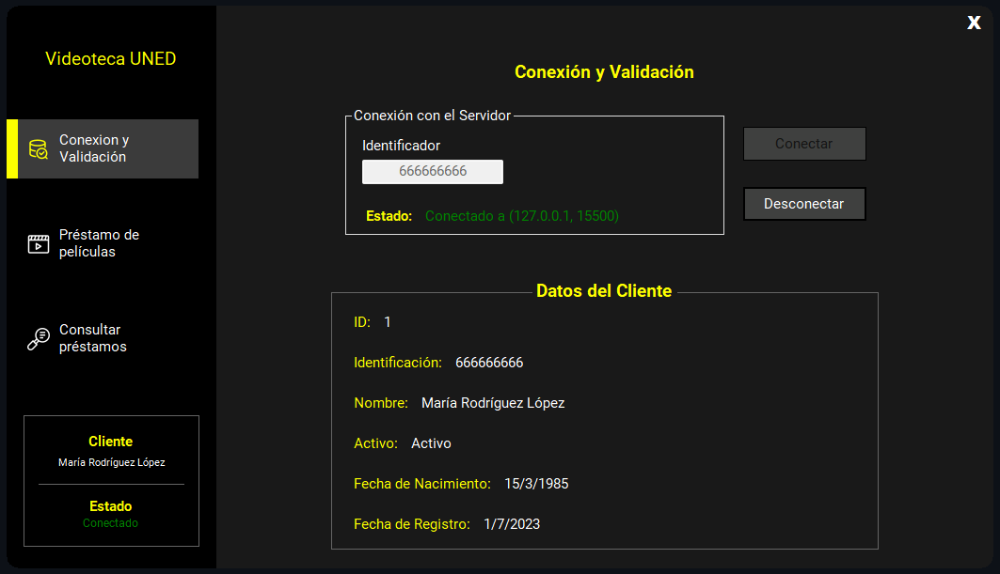

<div align="center">

# 🎬 VideotecaUNED

### Client-server movie rental management system

A desktop application developed with **C# and .NET**, using **TCP/IP** communication, **SQL Server** persistence, and support for multiple concurrent connections.

<br>


</div>

---

## 📌 About the Project

**VideotecaUNED** is a desktop application developed as the final project for the **Advanced Programming** course at Universidad Estatal a Distancia (UNED), during the second academic term of 2024.

The system implements a **client-server architecture**, where both applications communicate using the **TCP protocol**.

The project applies advanced programming concepts such as:

* Network communication.
* Client-server architecture.
* Multiple connection handling.
* Multithreading.
* CRUD operations.
* Data persistence.
* Exception handling.
* Real-time activity logging.

---

## 🏗️ Architecture

```text
┌──────────────────────┐
│        CLIENT        │
│                      │
│  Queries             │
│  Rentals             │
│  Availability        │
└──────────┬───────────┘
           │
           │ TCP/IP
           │
┌──────────▼───────────┐
│        SERVER        │
│                      │
│  Business logic      │
│  Multithreading      │
│  Data management     │
└──────────┬───────────┘
           │
           │
┌──────────▼───────────┐
│     SQL SERVER       │
│                      │
│  Persistence         │
│  Queries & CRUD      │
└──────────────────────┘
```

---

## 💻 Client Application

The client application allows users to interact with the movie rental system.

### Features

* Client validation against the database.
* View available branches.
* Browse available movies.
* Submit rental requests.
* View previous rentals.
* Communicate with the server through TCP/IP.

<div align="center">



</div>

---

## 🖥️ Server Application

The server centralizes the business logic, processes client requests, and manages communication with the database.

### Features

* Handles multiple connections using **multithreading**.
* Processes requests sent by connected clients.
* Performs CRUD operations for:

  * Categories.
  * Movies.
  * Managers.
  * Branches.
  * Clients.
* Reads and updates information in SQL Server.
* Maintains a real-time activity log of client actions.

<div align="center">


</div>

---

## 🛠️ Tech Stack

| Area          | Technology                    |
| ------------- | ----------------------------- |
| Language      | C#                            |
| Platform      | .NET Framework 4.8 / .NET 6.0 |
| Database      | SQL Server                    |
| Communication | TCP/IP                        |
| IDE           | Visual Studio Community 2022  |

---

## 🎥 Demo

The repository includes a full demonstration of the system.

▶️ [View demo video](imagenes/Demo.mp4)

You can also browse the [`imagenes`](imagenes) folder to view additional screenshots.

---

## 🚀 Run Locally

### 1. Clone the repository

```bash
git clone https://github.com/KendallCal/VideotecaUNED.git
```

### 2. Open the solution

Open the project using **Visual Studio Community 2022**.

### 3. Configure the database

Set up **SQL Server** using the database script included in the repository.

### 4. Run the server

Start the server application first so it can receive connections and process system operations.

### 5. Run the client

Start the client application and establish a connection with the server to use the available features.

---

## 🎓 Academic Context

This project was developed as part of the **Advanced Programming** course at Universidad Estatal a Distancia (UNED).

Beyond the academic requirements, the project provided practical experience with:

**object-oriented programming · networking · databases · concurrency · client-server architecture · exception handling**

---

<div align="center">

### 👨‍💻 Kendall Calderón

[](https://github.com/KendallCal)
[](https://www.linkedin.com/in/kendallcal/)
[](https://www.kendallc.dev/)

</div>
